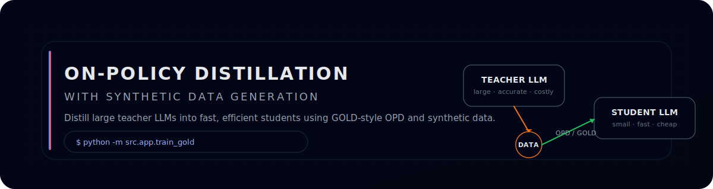
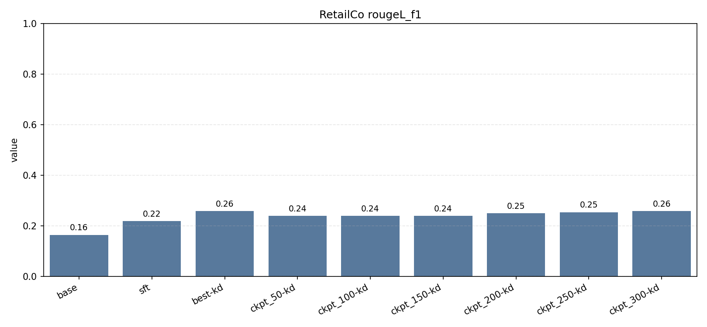
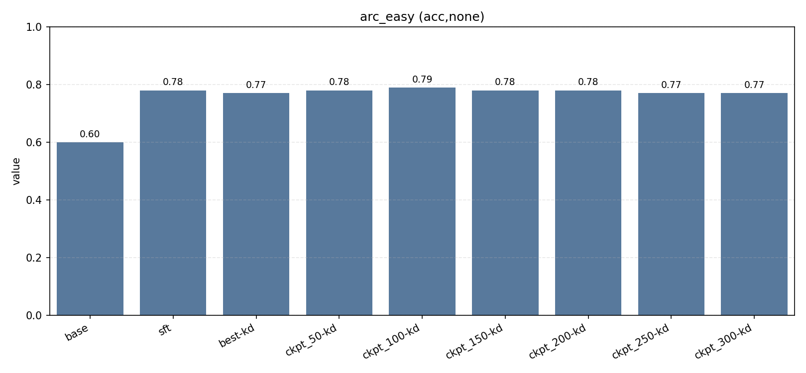
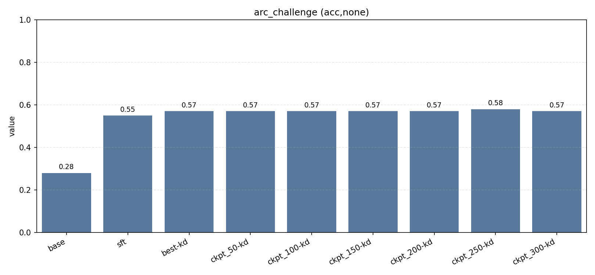
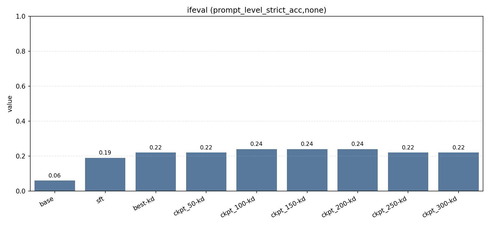
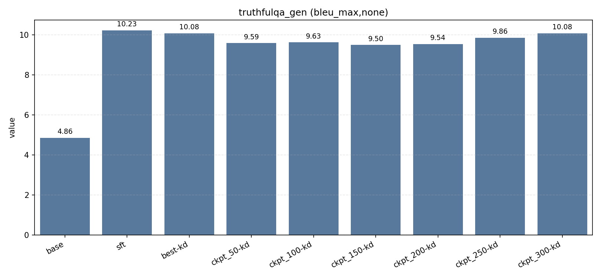
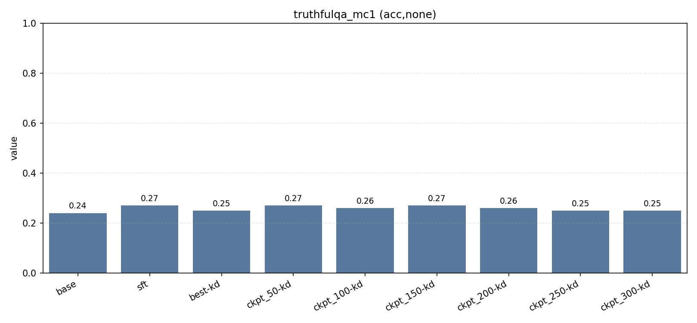
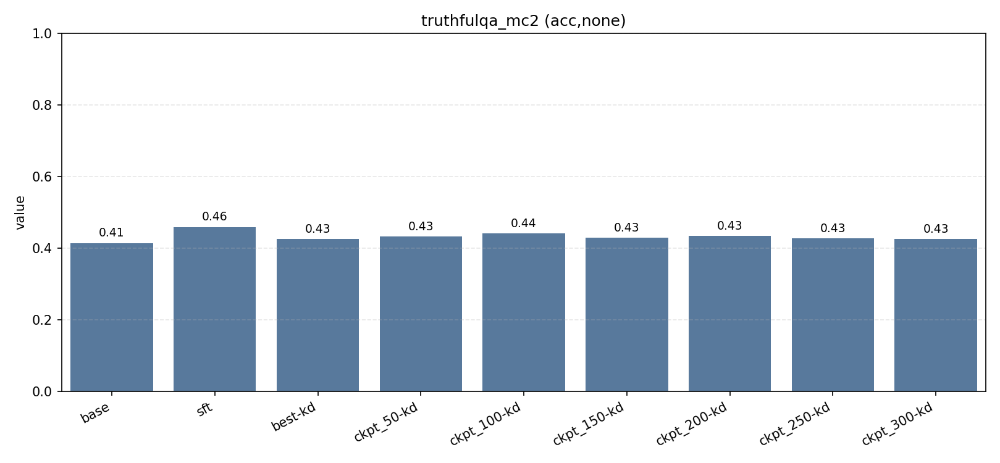

<p align="center">
  
</p>

# On-Policy Distillation with Synthetic Data Generation

An end-to-end framework that pairs GOLD-style on-policy distillation with synthetic data generation so you can train smaller students from stronger teachers using minimal manual data.

## Quick Links

- examples/nemo_opd_demo.py - End-to-end synthetic data + OPD demo
- examples/generate_custom_domain.py - Domain-specific data generator
- docs/NEMO_INTEGRATION.md - Synthetic data integration (OpenAI + NeMo)
- scripts/run_eval.sh - Benchmark runner
- .env_example - Baseline configuration template

## What This Repo Gives You

- ✔ A full OPD training loop (GOLD-style)  
  The student generates → teacher scores → GOLD loss updates the student.
- ✔ Built-in synthetic data generator  
  OpenAI + NVIDIA NeMo support out of the box. Useful for bootstrapping reasoning/instruction/mixed datasets before training.
- ✔ Multiple teacher backends (plug and play)  
  OpenRouter API (lightweight & cheap) • llama.cpp GGUF models • Full Hugging Face models (GPU recommended)
- ✔ Evaluation scripts & reporting  
  Quick way to compare: baseline small model, distilled student, teacher outputs.
- ✔ Configurable via environment variables  
  No rewriting loops. No fighting with giant config files.

## 🧠 High-Level Flow (The Story of a Distillation Run)

1. Start with a few seed examples — your domain, your prompts, your tasks.
2. Generate synthetic data using a powerful teacher — the teacher expands the tiny seed set into a rich dataset.
3. Run the OPD loop
   - Student produces rollouts
   - Teacher scores them
   - GOLD loss emphasizes tokens that match “good” behavior
4. Train until stable — smaller checkpoints go into your `OUTPUT_DIR`.
5. Run evaluation — see how the distilled model stacks against baseline or teacher.
6. (Optional) Inspect data quality — validate synthetic samples with teacher scoring.

This gives you a tiny, fast, domain-aligned model that behaves like the big one—without the cost.

## 🏁 Quick Start

### Requirements

- Python 3.10+
- OpenAI or NVIDIA API key
- 8GB RAM (16GB preferred)
- pip + git

### 1. Install

```bash
git clone https://github.com/debankadas/opd-synthetic-distillation
cd OPD
pip install -r requirements.txt
cp .env_example .env
```

Add your keys:

```bash
export OPENAI_API_KEY="sk-proj-YOURKEY"
# OR:
export NVIDIA_API_KEY="nvapi-YOURKEY"
```

### 2. Generate Synthetic Data

```bash
python examples/nemo_opd_demo.py \
  --num-records 100 \
  --backend openai \
  --output-dir synthetic_datasets
```

Creates OPD-ready CSV/JSON datasets. Cost: ~$0.10 for 100 samples.

### 3. Choose Teacher Backend

**OpenRouter (best for quick experiments)**

```bash
cat >> .env <<'EOF'
TEACHER_BACKEND=openrouter
OPENROUTER_API_KEY=sk-or-v1-YOURKEY
OPENROUTER_MODEL=qwen/qwen-2.5-7b-instruct
EOF
```

**Local GGUF (llama.cpp)**

```bash
cat >> .env <<'EOF'
TEACHER_BACKEND=gguf
TEACHER_GGUF=bartowski/Qwen2.5-7B-Instruct-GGUF
TEACHER_PREFERRED_QUANT=Q4_K_M
EOF
```

**Hugging Face Full Model (max quality, GPU)**

```bash
cat >> .env <<'EOF'
TEACHER_BACKEND=hf
TEACHER_MODEL_ID=Qwen/Qwen2.5-7B-Instruct
TEACHER_DTYPE=bf16
EOF
```

### 4. Train with On-Policy Distillation

```bash
cat >> .env <<'EOF'
DATA_PATH=synthetic_datasets/combined_100.json
OUTPUT_DIR=outputs/synthetic_opd_100
MAX_STEPS=200
SAVE_EVERY=50
EOF

python -m src.app.train_gold
```

Checkpoints appear in `outputs/`.

### 5. Evaluate

```bash
export KD_MODEL_PATH=outputs/synthetic_opd_100/best
export BASE_MODEL_ID=Qwen/Qwen2.5-0.5B-Instruct
bash scripts/run_eval.sh
```

Reports go to `reports/`.

### (Optional) Validate Data Quality

```bash
python examples/nemo_opd_demo.py \
  --skip-generation \
  --validate \
  --validate-samples 10
```

Validate synthetic samples with teacher scoring.

## 💡 Why OPD (vs SFT/KD/RLHF)

| Method     | Pros                             | Cons                               |
| ---------- | -------------------------------- | ---------------------------------- |
| SFT        | Simple                           | Massive static dataset needed      |
| Offline KD | Teacher gives answers            | Doesn’t fix distribution shift     |
| RLHF       | Great for alignment              | Expensive, reward models, unstable |
| OPD (this) | On-policy, efficient, data-light | Slightly more complex pipeline     |

This project adds synthetic bootstrap data, pluggable teachers, minimal config friction, and fewer moving parts than RLHF. Expect +5–10% gains over baseline Qwen2.5-0.5B on tasks like ARC, HellaSwag, TruthfulQA (numbers vary by setup).

## 📈 Results

Replace with your runs from `reports/` (generated by `scripts/run_eval.sh`):

















## 💰 Expected Costs (OpenAI)

| Examples | Cost    | Gen Time  | Train Time |
| -------- | ------- | --------- | ---------- |
| 100      | ~$0.10  | 1–2 min   | 10–20 min  |
| 1,000    | ~$1.00  | 10–15 min | 1–2 hrs    |
| 10,000   | ~$10.00 | ~2 hrs    | 10–20 hrs  |

Training time depends on your GPU/MPS/CPU.

## 🧱 Project Structure

```
src/
  app/
    train_gold.py
    run_distill.py
    prepare_dataset.py
  domain/
  infra/
    synthetic_data_generator.py
    teacher_local_hf.py
    teacher_llamacpp.py
    teacher_openrouter.py
    student_model.py
examples/
  nemo_opd_demo.py
  generate_custom_domain.py
docs/
  NEMO_INTEGRATION.md
scripts/
  run_eval.sh
  train_gpu_hf.sh
  train_mac_local.sh
```

## 🛠 Troubleshooting

- Missing keys → check `.env`.
- Slow generation → reduce batch size; check rate limits.
- CUDA OOM → reduce `MAX_NEW_TOKENS`, enable LoRA (`KD_LORA=1`), or pick a smaller student.
- Low teacher overlap → use a stronger teacher, improve prompts, or validate before training.

## 🔗 Resources

- OpenAI API – https://platform.openai.com/docs
- NeMo Data Designer – https://docs.nvidia.com/nemo-microservices/
- GOLD paper – https://arxiv.org/abs/2306.13649

## 📜 License

See LICENSE for details.

## Support

- Check logs in `runs/`
- Validate API keys
- Test with the 100-sample demo
- Manually spot-check generated data
